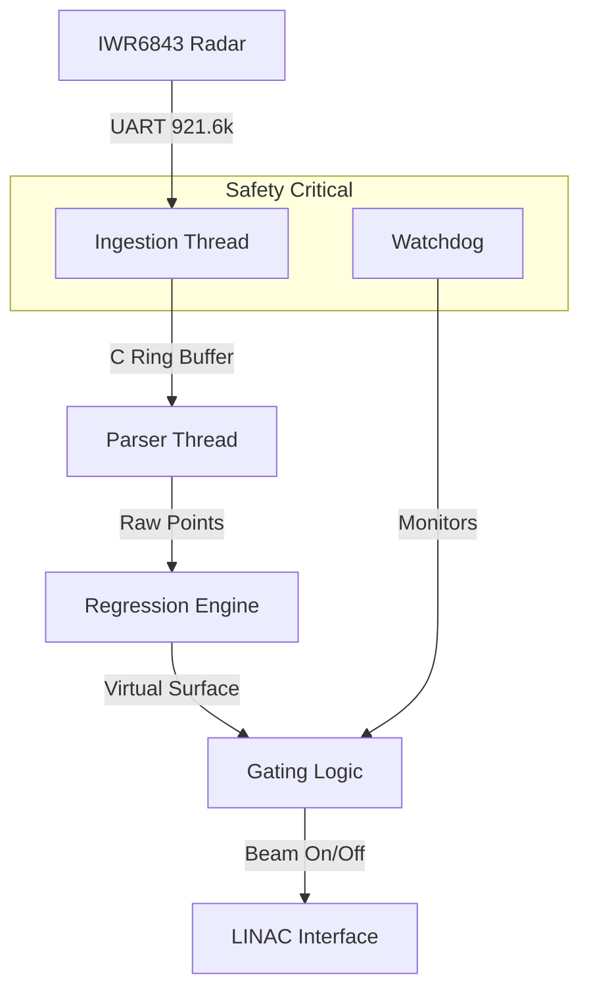

# mmWave-SGRT-hs

[](https://github.com/yourusername/mmWave-SGRT-hs)

### A Fail-Safe, Real-Time Surface Guided Radiation Therapy System utilizing 60 GHz Radar and Haskell.

**mmWave-SGRT-hs** is a research-grade implementation of a patient positioning and respiratory gating system for Radiation Oncology. It replaces traditional optical cameras with **60 GHz Millimeter-Wave (FMCW) Radar** to monitor patient breathing with sub-millimeter precision, regardless of room lighting, skin tone, or obstructions.

Built in **Haskell**, the architecture prioritizes correctness, type safety, and bounded latency over raw throughput, utilizing **Software Transactional Memory (STM)** to create a concurrent, mathematically provable gating engine.

## 🏗 Architecture



For a detailed deep-dive into the clinical context and architecture, see [Haskell Radar SGRT System Development.md](Haskell%20Radar%20SGRT%20System%20Development.md).

For developer setup and code structure, see [docs/DEVELOPER_GUIDE.md](lambda-wave/docs/DEVELOPER_GUIDE.md).

---

## 🏥 Clinical Context: The DIBH Imperative

In radiation therapy for left-sided breast cancer, the **Deep Inspiration Breath Hold (DIBH)** technique is used to physically separate the heart from the chest wall. This project uses radar to ensure the beam is only active when the patient is in the correct breath-hold position.

## 🚀 Getting Started

1.  **Clone the Repo**
    ```bash
    git clone https://github.com/yourusername/mmWave-SGRT-hs.git
    cd mmWave-SGRT-hs/lambda-wave
    ```

2.  **Build**
    ```bash
    stack build
    ```

3.  **Run**
    ```bash
    # Usage: stack run -- [Data Port] [User Port]
    stack run -- /dev/ttyACM1 /dev/ttyACM0
    ```

---

## ⚠️ Safety & Disclaimer

**THIS SOFTWARE IS FOR RESEARCH PURPOSES ONLY.**

*   **Not FDA Cleared:** This system has not been evaluated by the FDA.
*   **Not for Clinical Use:** Do not use this software to control radiation delivery on human patients.

*Designed in adherence to IEC 62304 concepts, but not certified.*
