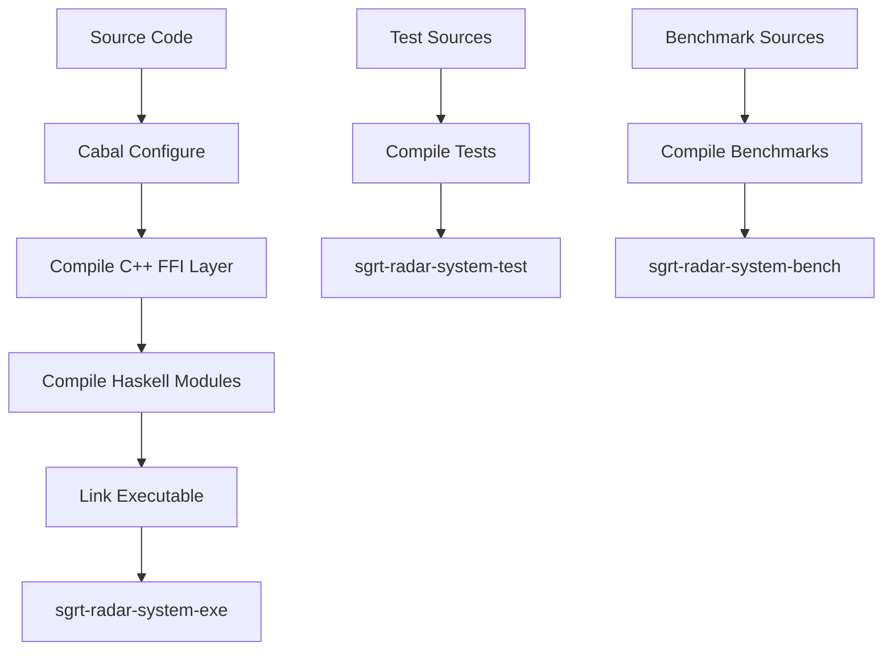

# Lambda-Wave Build Guide

**Version:** 0.1.0.0  
**Last Updated:** January 2026

---

## Table of Contents

1. [Overview](#overview)
2. [Prerequisites](#prerequisites)
3. [Build System Architecture](#build-system-architecture)
4. [Local Development Setup](#local-development-setup)
5. [Docker Build](#docker-build)
6. [Dependency Management](#dependency-management)
7. [Build Targets](#build-targets)
8. [Testing](#testing)
9. [Benchmarking](#benchmarking)
10. [Continuous Integration](#continuous-integration)
11. [Troubleshooting](#troubleshooting)

---

## Overview

Lambda-Wave uses a hybrid build system combining:
- **Cabal** for Haskell source code and dependencies
- **C++ compiler** (GCC/Clang) for FFI layer (cbits/)
- **Docker** for reproducible build environments
- **GitHub Actions** for CI/CD automation

The build system is designed for safety-critical development with:
- Strict compiler warnings
- Reproducible builds
- Deterministic dependency resolution
- Multi-stage Docker builds for efficiency

---

## Prerequisites

### Hardware Requirements
- **CPU:** x86_64 or ARM64 (2+ cores recommended)
- **RAM:** 4GB minimum, 8GB recommended
- **Disk:** 10GB free space for dependencies and build artifacts
- **Optional:** Texas Instruments IWR6843ISK mmWave sensor for hardware testing

### Software Requirements

#### For Local Development (Native Build)

**Operating System:**
- Linux (Ubuntu 20.04+ recommended)
- macOS 11+ (with Homebrew)
- Windows (with WSL2)

**Required Tools:**
```bash
# Haskell toolchain
- GHC 9.4+ (Haskell compiler)
- Cabal 3.6+ (build tool)
- Stack (optional alternative to Cabal)

# C++ toolchain
- GCC 7+ or Clang 10+
- C++11 standard library

# System libraries
- OpenGL development libraries
- GLUT (OpenGL Utility Toolkit)
- USB device support (libusb)
- Serial port libraries

# Development tools
- git
- make
- pkg-config
```

#### For Docker Development

**Required:**
- Docker 20.10+
- Docker Compose 1.29+ (optional, for multi-container setups)

**Recommended:**
- Docker BuildKit for faster builds
- 4GB+ RAM allocated to Docker

---

## Build System Architecture

### Directory Structure

```
lambda-wave/
├── sgrt-radar-system.cabal    # Main build configuration
├── cabal.project               # Project-wide Cabal settings
├── Dockerfile                  # Container build definition
├── docker-compose.yml          # Multi-container orchestration
│
├── src/                        # Haskell source code
│   ├── Control/               # Control plane (gating, UI)
│   ├── Data/                  # Data types and configuration
│   ├── FFI/                   # Foreign Function Interface
│   ├── Hardware/              # Hardware interaction layer
│   ├── Safety/                # Safety-critical systems
│   └── SignalProcessing/      # DSP algorithms
│
├── cbits/                     # C/C++ FFI implementation
│   ├── include/               # C/C++ headers
│   │   ├── ring_buffer.h
│   │   └── RingBuffer.h
│   └── src/                   # C/C++ source
│       ├── ring_buffer.cpp
│       └── RingBufferCheck.cpp
│
├── app/                       # Application entry point
│   └── Main.hs
│
├── test/                      # Test suites
│   ├── FFI/                   # FFI layer tests
│   ├── Hardware/              # Hardware layer tests
│   ├── SignalProcessing/      # DSP tests
│   ├── System/                # System-level tests
│   └── Spec.hs                # Test runner
│
├── bench/                     # Performance benchmarks
│   └── LatencyBench.hs
│
├── config/                    # Hardware configuration
│   └── ti_iwr6843isk/
│       └── sgrt_profile.cfg
│
└── scripts/                   # Build and setup scripts
    └── setup_env.sh
```

### Build Flow



---

## Local Development Setup

### Quick Start (Ubuntu/Debian)

```bash
# 1. Install system dependencies
sudo apt-get update
sudo apt-get install -y \
    ghc cabal-install \
    g++ \
    libgl1-mesa-dev \
    libglu1-mesa-dev \
    freeglut3-dev \
    libusb-1.0-0-dev \
    pkg-config \
    git

# 2. Update Cabal package list
cabal update

# 3. Clone repository
git clone https://github.com/fderuiter/lambda-wave.git
cd lambda-wave

# 4. Install dependencies
cabal build --only-dependencies

# 5. Build project
cabal build

# 6. Run tests
cabal test

# 7. Run executable
cabal run sgrt-radar-system-exe
```

### Quick Start (macOS with Homebrew)

```bash
# 1. Install Homebrew (if not already installed)
/bin/bash -c "$(curl -fsSL https://raw.githubusercontent.com/Homebrew/install/HEAD/install.sh)"

# 2. Install dependencies
brew install ghc cabal-install
brew install pkg-config
brew install glew glfw3

# 3. Follow steps 2-7 from Ubuntu guide above
```

### Quick Start (Windows with WSL2)

```bash
# 1. Install WSL2 with Ubuntu 20.04
wsl --install -d Ubuntu-20.04

# 2. Inside WSL, follow Ubuntu Quick Start guide
```

### Detailed Setup

#### Step 1: Install Haskell Toolchain

**Option A: GHCup (Recommended)**
```bash
curl --proto '=https' --tlsv1.2 -sSf https://get-ghcup.haskell.org | sh
ghcup install ghc 9.4.8
ghcup install cabal 3.10.1.0
ghcup set ghc 9.4.8
ghcup set cabal 3.10.1.0
```

**Option B: System Package Manager**
```bash
# Ubuntu/Debian
sudo apt-get install ghc-9.4 cabal-install

# Fedora/RHEL
sudo dnf install ghc cabal-install

# macOS
brew install ghc cabal-install
```

#### Step 2: Install C++ Build Tools

```bash
# Ubuntu/Debian
sudo apt-get install build-essential g++

# Fedora/RHEL
sudo dnf install gcc-c++

# macOS
xcode-select --install
```

#### Step 3: Install System Libraries

```bash
# Run the setup script
chmod +x scripts/setup_env.sh
sudo scripts/setup_env.sh
```

Or manually:

```bash
# OpenGL libraries
sudo apt-get install -y \
    libgl1-mesa-dev \
    libglu1-mesa-dev \
    freeglut3-dev

# USB and serial support
sudo apt-get install -y \
    libusb-1.0-0-dev \
    libftdi1-dev

# Additional tools
sudo apt-get install -y \
    pkg-config \
    libc6-dev
```

#### Step 4: Configure Serial Port Access (for Hardware)

```bash
# Add user to dialout group (for serial port access)
sudo usermod -a -G dialout $USER

# Log out and log back in for changes to take effect
```

#### Step 5: Build Project

```bash
# Update package index
cabal update

# Build dependencies (this may take 10-30 minutes first time)
cabal build --only-dependencies

# Build project
cabal build

# Or build with specific flags
cabal build --ghc-options="-O2"
```

---

## Docker Build

### Standard Docker Build

The Dockerfile uses a specific SHA-256 digest for the base image (`haskell:9.4.7`) to ensure build determinism (P1-002).

```bash
# Build image
docker build -t lambda-wave:latest .

# Run in simulation mode
docker run -it lambda-wave:latest

# Run with hardware access (Linux only)
docker run -it \
    --device=/dev/ttyUSB0 \
    --device=/dev/ttyUSB1 \
    -e SGRT_SENSOR_PORT=/dev/ttyUSB0 \
    -e SGRT_CLI_PORT=/dev/ttyUSB1 \
    lambda-wave:latest
```

### Updating the Base Image

To update the base image (e.g., for security patches), follow this procedure (SOUP Management, see [Security Policy](../SECURITY.md)):

1.  Pull the new image tag locally to verify it:
    ```bash
    docker pull haskell:9.4.7
    ```
2.  Inspect the image to get the specific SHA-256 digest:
    ```bash
    docker inspect --format='{{index .RepoDigests 0}}' haskell:9.4.7
    ```
    Ensure the output is in the format `haskell@sha256:...`.
3.  Update the `Dockerfile` `FROM` instruction with the new digest.
4.  Rebuild and verify determinism as per the [Standard Docker Build](#standard-docker-build) section.

### Docker Compose (Multi-stage Development)

```bash
# Build and start all services
docker-compose up --build

# Run in detached mode
docker-compose up -d

# View logs
docker-compose logs -f

# Stop services
docker-compose down
```

### Multi-stage Build Optimization

The Dockerfile uses multi-stage builds for efficiency:

```dockerfile
# Stage 1: Build dependencies (cached layer)
FROM haskell:9.4 as deps
WORKDIR /build
COPY sgrt-radar-system.cabal cabal.project ./
RUN cabal update && cabal build --only-dependencies

# Stage 2: Build application
FROM haskell:9.4 as build
WORKDIR /build
COPY --from=deps /root/.cabal /root/.cabal
COPY . .
RUN cabal build

# Stage 3: Runtime (minimal image)
FROM ubuntu:22.04
COPY --from=build /build/dist-newstyle/.../sgrt-radar-system-exe /usr/local/bin/
CMD ["sgrt-radar-system-exe"]
```

---

## Dependency Management

### Cabal Configuration

**sgrt-radar-system.cabal** defines:
- Package metadata (name, version, license)
- Build dependencies and version constraints
- Compiler flags and warnings
- Module structure
- FFI integration

**cabal.project** provides:
- Project-wide configuration
- Dependency resolution strategy
- Optimization settings
- Package flags

### Key Dependencies

```haskell
build-depends:
    base >=4.7 && <5        -- Haskell standard library
  , hmatrix                 -- Matrix operations (BLAS/LAPACK)
  , stm                     -- Software Transactional Memory
  , clock                   -- High-precision timing
  , binary                  -- Binary parsing
  , bytestring              -- Efficient byte arrays
  , vector                  -- Fast arrays
  , serialport              -- Serial communication
  , unix                    -- POSIX system calls
  , OpenGL                  -- 3D graphics
  , GLUT                    -- OpenGL utilities
  , deepseq                 -- Deep evaluation control
```

### Updating Dependencies

```bash
# Update package index
cabal update

# List outdated packages
cabal outdated

# Upgrade all dependencies (careful - may break build)
cabal build --upgrade-dependencies

# Freeze dependencies for reproducible builds
cabal freeze
# This creates cabal.project.freeze with exact versions
```

### Dependency Tree

```bash
# View dependency tree
cabal build --dry-run

# Detailed dependency information
cabal list-bin sgrt-radar-system-exe
```

---

## Build Targets

### Executable

```bash
# Build main executable
cabal build sgrt-radar-system-exe

# Build with optimizations
cabal build sgrt-radar-system-exe --ghc-options="-O2"

# Build with debug symbols
cabal build sgrt-radar-system-exe --ghc-options="-g"

# Run directly
cabal run sgrt-radar-system-exe

# Install to ~/.cabal/bin
cabal install sgrt-radar-system-exe
```

### Library

```bash
# Build library only
cabal build sgrt-radar-system

# Generate documentation
cabal haddock sgrt-radar-system

# Open documentation in browser
cabal haddock sgrt-radar-system --haddock-options="--odir=docs/haddock"
```

### Test Suite

```bash
# Build tests
cabal build sgrt-radar-system-test

# Run all tests
cabal test

# Run with verbose output
cabal test --test-show-details=direct

# Run specific test module
cabal test --test-options="-m FFI.RingBuffer"

# Generate test coverage report
cabal test --enable-coverage
cabal hpc report sgrt-radar-system-test
```

### Benchmarks

```bash
# Build benchmarks
cabal build sgrt-radar-system-bench

# Run benchmarks
cabal bench

# Run with specific options
cabal bench --benchmark-options="+RTS -N4 -RTS"

# Generate HTML report
cabal bench --benchmark-options="--output=bench_results.html"
```

---

## Testing

### Test Structure

```
test/
├── Spec.hs                       # Test runner (main entry point)
├── FFI/RingBuffer/
│   ├── TypesSpec.hs             # FFI types tests
│   └── IOSpec.hs                # Ring buffer I/O tests
├── Hardware/
│   ├── ConsumerSpec.hs          # Packet parser tests
│   └── ControlSpec.hs           # Sensor control tests
├── SignalProcessing/
│   └── FMCWSpec.hs              # FMCW algorithm tests
├── RegressionSpec.hs            # Regression analysis tests
├── ParserSpec.hs                # General parsing tests
└── System/
    └── RTSSpec.hs               # Runtime system tests
```

### Running Tests

```bash
# Run all tests
cabal test

# Run with parallel execution
cabal test --ghc-options="-threaded -with-rtsopts=-N"

# Run specific test suite
cabal test sgrt-radar-system-test

# Run with pattern matching
cabal test --test-options="-m FMCW"

# Run with QuickCheck verbose mode
cabal test --test-options="--qc-verbose"

# Run with specific number of QuickCheck tests
cabal test --test-options="--qc-max-success=1000"
```

### Test Coverage

```bash
# Enable coverage
cabal test --enable-coverage

# Generate HTML report
cabal hpc report sgrt-radar-system-test --destdir=coverage

# View coverage
open coverage/hpc_index.html  # macOS
xdg-open coverage/hpc_index.html  # Linux
```

---

## Benchmarking

### Performance Benchmarks

```bash
# Run latency benchmarks
cabal bench sgrt-radar-system-bench

# Save results
cabal bench --benchmark-options="--output=bench.html"

# Compare with baseline
cabal bench --benchmark-options="--baseline=baseline.csv --output=comparison.html"

# Profile memory usage
cabal bench --ghc-options="-rtsopts -with-rtsopts=-s"
```

### Profiling

```bash
# Build with profiling enabled
cabal build --enable-profiling

# Run with time profiling
cabal run sgrt-radar-system-exe -- +RTS -p -RTS

# Run with heap profiling
cabal run sgrt-radar-system-exe -- +RTS -h -RTS
hp2ps -c sgrt-radar-system-exe.hp

# Run with detailed profiling
cabal run sgrt-radar-system-exe -- +RTS -P -RTS
```

---

## Continuous Integration

### GitHub Actions Workflows

#### Lint Workflow (.github/workflows/lint.yml)

```yaml
name: Lint
on: [push]
jobs:
  lint:
    runs-on: ubuntu-latest
    steps:
      - uses: actions/checkout@v3
      - name: Run HLint
        run: hlint src/ app/ test/
```

**Triggers:** All pushes to feature/* and bugfix/* branches  
**Purpose:** Static analysis with hlint

#### Build and Test Workflow (.github/workflows/build-and-test.yml)

```yaml
name: Build and Test
on:
  pull_request:
    branches: [develop, main]
jobs:
  build:
    runs-on: ubuntu-latest
    container:
      image: haskell:9.8  # Note: Project supports GHC 9.4+, CI uses 9.8
    steps:
      - uses: actions/checkout@v3
      - name: Install system dependencies
        run: scripts/setup_env.sh
      - name: Update Cabal
        run: cabal update
      - name: Build dependencies
        run: cabal build --only-dependencies
      - name: Build
        run: cabal build
      - name: Run Tests
        run: cabal test
```

**Triggers:** Pull requests to develop or main  
**Purpose:** Full build and test verification  
**Note:** CI uses GHC 9.8 for testing, but the project is compatible with GHC 9.4+

#### Release Workflow (.github/workflows/release.yml)

```yaml
name: Release
on:
  push:
    tags:
      - 'v*'
jobs:
  release:
    runs-on: ubuntu-latest
    steps:
      - uses: actions/checkout@v3
      - name: Build release binary
        run: cabal build --ghc-options="-O2"
      - name: Generate checksum
        run: sha256sum dist-newstyle/.../sgrt-radar-system-exe > checksum.txt
      - name: Create GitHub Release
        uses: actions/create-release@v1
        with:
          tag_name: ${{ github.ref }}
          release_name: Release ${{ github.ref }}
```

**Triggers:** Version tags (v1.0.0, v1.1.0, etc.)  
**Purpose:** Automated release creation with checksums

### Local CI Simulation

```bash
# Run lint locally
hlint src/ app/ test/

# Run build locally (mimics CI)
docker run -v $(pwd):/app -w /app haskell:9.8 sh -c "
  cabal update && \
  cabal build --only-dependencies && \
  cabal build && \
  cabal test
"
```

---

## Troubleshooting

### Common Build Issues

#### Issue: "Could not resolve dependencies"

```bash
# Solution 1: Update package index
cabal update

# Solution 2: Clean build artifacts
cabal clean
rm -rf dist-newstyle/

# Solution 3: Reset Cabal cache
rm -rf ~/.cabal/packages/
cabal update
```

#### Issue: "Missing C library"

```bash
# Ubuntu/Debian
sudo apt-get install -y pkg-config
pkg-config --list-all | grep -i <library-name>
sudo apt-get install <library>-dev

# macOS
brew search <library-name>
brew install <library>
```

#### Issue: "OpenGL not found"

```bash
# Ubuntu/Debian
sudo apt-get install -y freeglut3-dev libgl1-mesa-dev libglu1-mesa-dev

# macOS
brew install glew glfw3

# Verify installation
pkg-config --cflags --libs gl glu glut
```

#### Issue: "Permission denied: /dev/ttyUSB0"

```bash
# Add user to dialout group
sudo usermod -a -G dialout $USER

# Or temporarily change permissions (not recommended for production)
sudo chmod 666 /dev/ttyUSB0
```

#### Issue: "GHC version mismatch"

```bash
# Check current GHC version
ghc --version

# Install correct version with GHCup
ghcup install ghc 9.4.8
ghcup set ghc 9.4.8

# Verify
ghc --version
```

### Build Performance Optimization

```bash
# Use parallel builds
cabal build -j$(nproc)

# Increase GHC memory limit
cabal build --ghc-options="+RTS -M4G -RTS"

# Enable faster linking
cabal build --ghc-options="-split-sections"

# Use LLVM backend (if available)
cabal build --ghc-options="-fllvm"
```

### Debugging Build Issues

```bash
# Verbose build output
cabal build -v3

# Show GHC commands
cabal build --ghc-options="-v"

# Check build plan
cabal build --dry-run

# Inspect package database
ghc-pkg list

# Validate package configuration
cabal check
```

---

## Advanced Topics

### Cross-Compilation

```bash
# Build for different architecture
cabal build --with-compiler=arm-linux-ghc

# Static linking for portable binaries
cabal build --ghc-options="-static -optl-static"
```

### Custom Build Flags

Edit `sgrt-radar-system.cabal`:

```cabal
flag development
  description: Enable development features
  default: False

library
  if flag(development)
    cpp-options: -DDEVELOPMENT
    ghc-options: -Wall -Werror
```

Build with flag:
```bash
cabal build -f development
```

### Reproducible Builds

```bash
# Freeze dependencies
cabal freeze

# Build with frozen dependencies
cabal build --project-file=cabal.project.freeze

# Verify build reproducibility
cabal build
sha256sum dist-newstyle/.../sgrt-radar-system-exe
# Rebuild and compare checksums
```

---

## Additional Resources

- **Cabal User Guide:** https://cabal.readthedocs.io/
- **GHC User Guide:** https://ghc.gitlab.haskell.org/ghc/doc/users_guide/
- **Haskell Language:** https://www.haskell.org/documentation/
- **Project Repository:** https://github.com/fderuiter/lambda-wave
- **Issue Tracker:** https://github.com/fderuiter/lambda-wave/issues

---

**Last Updated:** January 2026  
**Maintainer:** Frederick de Ruiter ([@fderuiter](https://github.com/fderuiter))  
**Email:** fpderuiter@gmail.com

## API Documentation

The Lambda-Wave project uses Haddock to generate comprehensive API documentation directly from the source code. The Haddock documentation includes descriptions of modules, functions, parameters, and return types, providing an essential resource for developers.

### Generating Haddock Documentation

To generate the HTML documentation, run the following command using Cabal:

```bash
cabal haddock
```

### Viewing Documentation

Once generated, the HTML documentation will be placed in `docs/` and can be viewed by opening the `index.html` file in a web browser.
