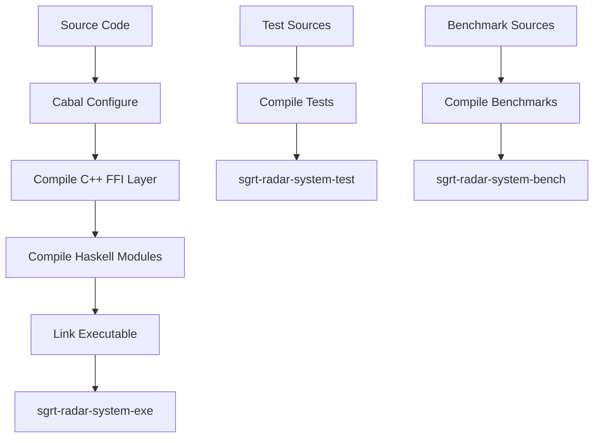

# Lambda-Wave Build Guide

**Version:** 0.1.0.0  
**Last Updated:** January 2026

---

## Table of Contents

1. [Overview](#overview)
2. [Prerequisites](#prerequisites)
3. [Build System Architecture](#build-system-architecture)
4. [Local Development Setup](#local-development-setup)
5. [Docker Build](#docker-build)
6. [Dependency Management](#dependency-management)
7. [Build Targets](#build-targets)
8. [Testing](#testing)
9. [Benchmarking](#benchmarking)
10. [Continuous Integration](#continuous-integration)
11. [Troubleshooting](#troubleshooting)

---

## Overview

Lambda-Wave uses a hybrid build system combining:
- **Cabal** for Haskell source code and dependencies
- **C++ compiler** (GCC/Clang) for FFI layer (cbits/)
- **Docker** for reproducible build environments
- **GitHub Actions** for CI/CD automation

The build system is designed for safety-critical development with:
- Strict compiler warnings
- Reproducible builds
- Deterministic dependency resolution
- Multi-stage Docker builds for efficiency

---

## Prerequisites

### Hardware Requirements
- **CPU:** x86_64 or ARM64 (2+ cores recommended)
- **RAM:** 4GB minimum, 8GB recommended
- **Disk:** 10GB free space for dependencies and build artifacts
- **Optional:** Texas Instruments IWR6843ISK mmWave sensor for hardware testing

### Software Requirements

#### For Local Development (Native Build)

**Operating System:**
- Linux (Ubuntu 20.04+ recommended)
- macOS 11+ (with Homebrew)
- Windows (with WSL2)

**Required Tools:**
```bash
# Haskell toolchain
- GHC 9.4+ (Haskell compiler)
- Cabal 3.6+ (build tool)
- Stack (optional alternative to Cabal)

# C++ toolchain
- GCC 7+ or Clang 10+
- C++11 standard library

# System libraries (for Core)
- USB device support (libusb)
- Serial port libraries

# System libraries (for UI)
- OpenGL development libraries (libGL, libGLU)
- GLUT (freeglut3)
- Zlib (zlib1g)

# Development tools
- git
- make
- pkg-config
```

#### For Docker Development

**Required:**
- Docker 20.10+
- Docker Compose 1.29+ (optional, for multi-container setups)

**Recommended:**
- Docker BuildKit for faster builds
- 4GB+ RAM allocated to Docker

---

## Build System Architecture

### Directory Structure

```
lambda-wave/
├── sgrt-radar-system.cabal    # Main build configuration
├── cabal.project               # Project-wide Cabal settings
├── Dockerfile                  # Container build definition
├── docker-compose.yml          # Multi-container orchestration
│
├── src/                        # Haskell source code
│   ├── Control/               # Control plane (gating, meshing)
│   ├── Data/                  # Data types and configuration
│   ├── FFI/                   # Foreign Function Interface
│   ├── Hardware/              # Hardware interaction layer
│   ├── Safety/                # Safety-critical systems
│   └── SignalProcessing/      # DSP algorithms
│
├── cbits/                     # C/C++ FFI implementation
│   ├── include/               # C/C++ headers
│   └── src/                   # C/C++ source
│
├── app/                       # Application entry point
│   ├── Main.hs
│   ├── Control/UI/            # OpenGL Visualization (Optional)
│   └── Control/WebUI/         # Web Dashboard (Optional)
│
├── test/                      # Test suites
│   ├── FFI/                   # FFI layer tests
│   ├── Hardware/              # Hardware layer tests
│   ├── SignalProcessing/      # DSP tests
│   ├── System/                # System-level tests
│   ├── WebUI/                 # UI verification tests
│   └── Spec.hs                # Test runner
│
├── bench/                     # Performance benchmarks
│   └── LatencyBench.hs
│
├── config/                    # Hardware configuration
│   └── ti_iwr6843isk/
│       └── sgrt_profile.cfg
│
└── scripts/                   # Build and setup scripts
    └── setup_env.sh
```

### Build Flow



---

## Local Development Setup

### Quick Start (Ubuntu/Debian)

```bash
# 1. Install system dependencies
sudo apt-get update
sudo apt-get install -y \
    ghc cabal-install \
    g++ \
    libgl1-mesa-dev \
    libglu1-mesa-dev \
    freeglut3-dev \
    libusb-1.0-0-dev \
    zlib1g-dev \
    pkg-config \
    git

# 2. Update Cabal package list
cabal update

# 3. Clone repository
git clone https://github.com/fderuiter/lambda-wave.git
cd lambda-wave

# 4. Install dependencies
cabal build --only-dependencies

# 5. Build project
cabal build

# 6. Run tests
cabal test

# 7. Run executable
cabal run sgrt-radar-system-exe
```

### Quick Start (macOS with Homebrew)

```bash
# 1. Install Homebrew (if not already installed)
/bin/bash -c "$(curl -fsSL https://raw.githubusercontent.com/Homebrew/install/HEAD/install.sh)"

# 2. Install dependencies
brew install ghc cabal-install
brew install pkg-config
brew install glew glfw3 freeglut zlib

# 3. Follow steps 2-7 from Ubuntu guide above
```

### Quick Start (Windows with WSL2)

```bash
# 1. Install WSL2 with Ubuntu 20.04
wsl --install -d Ubuntu-20.04

# 2. Inside WSL, follow Ubuntu Quick Start guide
# Note: For OpenGL visualization on Windows 11 WSL2, install VcXsrv or similar X server.
```

---

## Build Targets

### Executable

```bash
# Build main executable (Headless Mode - Default)
cabal build sgrt-radar-system-exe

# Build with OpenGL Visualization
# Requires: freeglut3-dev, libgl1-mesa-dev
cabal build sgrt-radar-system-exe --flags=enable-ui

# Build with Web Dashboard
# Requires: zlib1g-dev
cabal build sgrt-radar-system-exe --flags=enable-web-ui

# Run directly
cabal run sgrt-radar-system-exe --flags=enable-web-ui
```

### Library

```bash
# Build library only (Safety Core)
cabal build sgrt-radar-system

# Generate documentation
cabal haddock sgrt-radar-system

# Open documentation in browser
cabal haddock sgrt-radar-system --haddock-options="--odir=docs/haddock"
```

### Test Suite

```bash
# Build tests
cabal build sgrt-radar-system-test

# Run all tests
cabal test

# Run with verbose output
cabal test --test-show-details=direct
```

---

## Testing

### Test Structure

```
test/
├── Spec.hs                       # Test runner (main entry point)
├── FFI/RingBuffer/
│   ├── TypesSpec.hs             # FFI types tests
│   └── IOSpec.hs                # Ring buffer I/O tests
├── Hardware/
│   ├── ConsumerSpec.hs          # Packet parser tests
│   └── ControlSpec.hs           # Sensor control tests
├── SignalProcessing/
│   └── FMCWSpec.hs              # FMCW algorithm tests
├── WebUI/
│   ├── ServerSpec.hs            # WebSocket integration tests
│   └── verify_frontend.py       # Playwright E2E tests
├── RegressionSpec.hs            # Regression analysis tests
└── System/
    └── RTSSpec.hs               # Runtime system tests
```

### Running Tests

```bash
# Run all tests
cabal test

# Run with parallel execution
cabal test --ghc-options="-threaded -with-rtsopts=-N"

# Run UI verification (Manual)
python3 test/WebUI/verify_frontend.py
```

### Test Coverage

```bash
# Enable coverage
cabal test --enable-coverage

# Generate HTML report
cabal hpc report sgrt-radar-system-test --destdir=coverage

# View coverage
open coverage/hpc_index.html  # macOS
xdg-open coverage/hpc_index.html  # Linux
```

---

## Benchmarking

### Performance Benchmarks

```bash
# Run latency benchmarks
cabal bench sgrt-radar-system-bench

# Save results
cabal bench --benchmark-options="--output=bench.html"

# Compare with baseline
cabal bench --benchmark-options="--baseline=baseline.csv --output=comparison.html"

# Profile memory usage
cabal bench --ghc-options="-rtsopts -with-rtsopts=-s"
```

---

## Continuous Integration

### GitHub Actions Workflows

#### Build and Test Workflow (.github/workflows/build-and-test.yml)

```yaml
name: Build and Test
on:
  pull_request:
    branches: [develop, main]
jobs:
  build:
    runs-on: ubuntu-latest
    container:
      image: haskell:9.8
    steps:
      - uses: actions/checkout@v3
      - name: Install system dependencies
        run: scripts/setup_env.sh
      - name: Build
        run: cabal build
      - name: Run Tests
        run: cabal test
```

**Note:** The CI pipeline currently validates the **Headless Core**. UI components are built locally or in specific UI workflows (planned).

---

## Troubleshooting

### Common Build Issues

#### Issue: "Missing C library: z" or "Missing C library: GL"

```bash
# Ubuntu/Debian
sudo apt-get install -y zlib1g-dev freeglut3-dev libgl1-mesa-dev

# macOS
brew install zlib freeglut
```

#### Issue: "OpenGL not found"

```bash
# Ubuntu/Debian
sudo apt-get install -y freeglut3-dev libgl1-mesa-dev libglu1-mesa-dev

# macOS
brew install glew glfw3

# Verify installation
pkg-config --cflags --libs gl glu glut
```

#### Issue: "Permission denied: /dev/ttyUSB0"

```bash
# Add user to dialout group
sudo usermod -a -G dialout $USER

# Or temporarily change permissions (not recommended for production)
sudo chmod 666 /dev/ttyUSB0
```

#### Issue: "GHC version mismatch"

```bash
# Check current GHC version
ghc --version

# Install correct version with GHCup
ghcup install ghc 9.4.8
ghcup set ghc 9.4.8
```

### Build Performance Optimization

```bash
# Use parallel builds
cabal build -j$(nproc)

# Increase GHC memory limit
cabal build --ghc-options="+RTS -M4G -RTS"
```

---

## Advanced Topics

### Cross-Compilation

```bash
# Build for different architecture
cabal build --with-compiler=arm-linux-ghc

# Static linking for portable binaries
cabal build --ghc-options="-static -optl-static"
```

### Custom Build Flags

Edit `sgrt-radar-system.cabal`:

```cabal
flag enable-ui
  description: Enable the OpenGL-based visualization UI
  default: False

flag enable-web-ui
  description: Enable the Web-based visualization UI
  default: False
```

Build with flag:
```bash
cabal build -f enable-web-ui
```

---

**Last Updated:** January 2026  
**Maintainer:** Frederick de Ruiter ([@fderuiter](https://github.com/fderuiter))  
**Email:** fpderuiter@gmail.com
