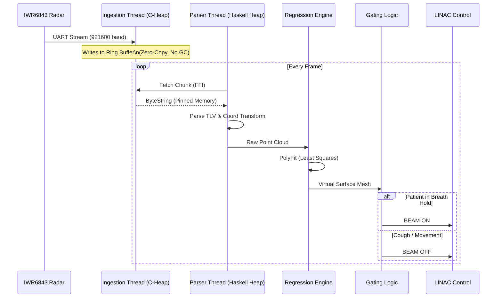

# Developer's Guide 📘

## 📂 Codebase Structure

### `/src` - Core Logic
*   **`LambdaWave/Hardware`**: Hardware interaction layer.
    *   `Ingestion.hs`: **Dragon 🐉**. Handles raw UART data ingestion using FFI and Pinned Memory.
    *   `Parser.hs`: Converts raw bytes into `RadarFrame` structures using the `binary` library.
*   **`LambdaWave/Analysis`**: Mathematical core.
    *   `Regression.hs`: Implements Bi-Quadratic Polynomial Least Squares fitting.
*   **`LambdaWave/Safety`**: Safety-critical monitoring.
    *   `Watchdog.hs`: **Dragon 🐉**. A "Dead Man's Switch" that kills the application if latency exceeds limits.

### `/cbits` - Foreign Function Interface
*   `ring_buffer.c`: A circular buffer implementation in C to facilitate Zero-Copy data ingestion.

### `/app`
*   `Main.hs`: The application entry point. Wires the `Ingestion`, `Parser`, `Gating`, and `Watchdog` threads together using `forkOS` and `STM`.

## 🔄 Data Flow (The Pipeline)

## 🧪 Testing Strategy

*   **Unit Tests:** Located in `test/`. Run with `stack test`.
*   **Ingestion Safety:** The `cbits` code is critical. Verify memory safety manually or with Valgrind if modifying `ring_buffer.c`.

## ⚠️ The Dragons 🐉

1.  **Ingestion Efficiency:** The current Haskell -> C `write_byte` loop is inefficient (`O(N)` FFI calls).
2.  **Watchdog:** If debugging with breakpoints, the Watchdog **will** trip and kill the process. Disable it during deep debugging sessions.
