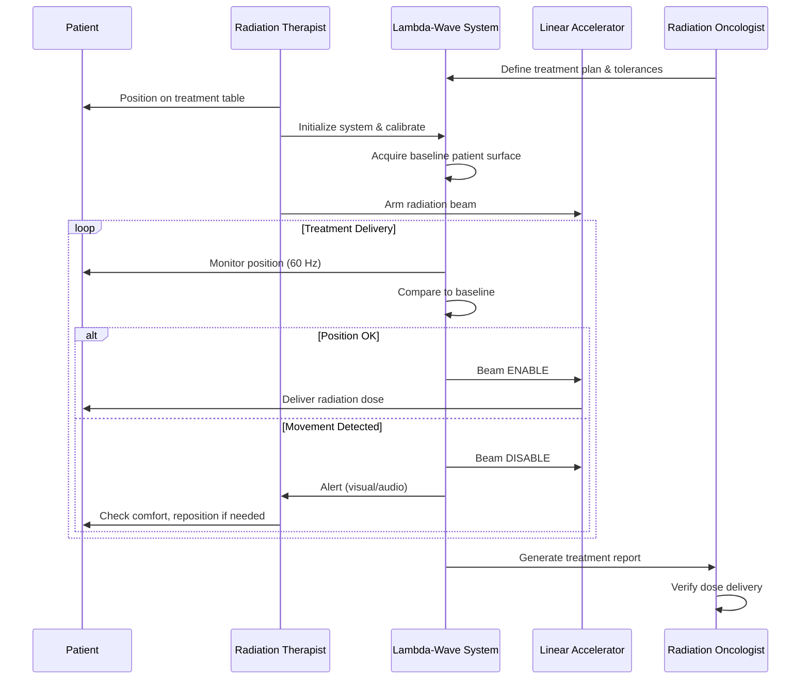
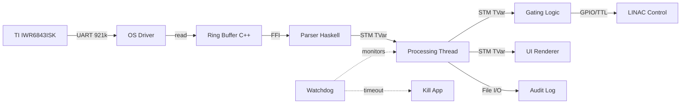

# Lambda-Wave: Purpose, Architecture & Technical Overview

**Version:** 0.1.0.0  
**Last Updated:** January 2026  
**Classification:** Safety-Critical Medical Software (IEC 62304 Class C)

---

## Table of Contents

1. [Executive Summary](#executive-summary)
2. [Medical Context & Purpose](#medical-context--purpose)
3. [System Architecture](#system-architecture)
4. [Technical Approach](#technical-approach)
5. [Safety & Compliance](#safety--compliance)
6. [Data Flow & Processing Pipeline](#data-flow--processing-pipeline)
7. [Key Components](#key-components)
8. [Design Decisions & Rationale](#design-decisions--rationale)
9. [Future Vision](#future-vision)

---

## Executive Summary

### What is Lambda-Wave?

Lambda-Wave is a **safety-critical Surface Guided Radiation Therapy (SGRT) system** that uses millimeter-wave (mmWave) radar technology to track patient motion in real-time during cancer radiotherapy treatments. The system interfaces with Texas Instruments IWR6843ISK radar sensors to provide sub-millimeter accuracy motion tracking and automatic radiation beam gating.

### The Problem We Solve

**Challenge:** During radiation therapy for cancer treatment, even small patient movements (breathing, coughing, involuntary muscle movements) can cause the radiation beam to miss the tumor and damage healthy tissue.

**Solution:** Lambda-Wave continuously monitors patient position using mmWave radar and automatically controls the radiation beam:
- ✅ **Beam ON** when patient is stationary (within tolerance)
- ⛔ **Beam OFF** when patient moves outside acceptable range

**Impact:** 
- Improved treatment accuracy
- Reduced radiation exposure to healthy tissue
- Better patient outcomes
- Real-time safety monitoring

### Key Characteristics

- **Safety-Critical:** IEC 62304 Class C compliance
- **Real-Time:** End-to-end safety response latency < 50 ms, with select internal processing stages operating at sub-millisecond latency
- **High Precision:** Sub-millimeter motion detection
- **Non-Contact:** No markers or devices on patient
- **Hardware:** TI IWR6843ISK 77-81 GHz mmWave radar
- **Software:** Haskell (safety) + C++ (performance) + OpenGL (visualization)

---

## Medical Context & Purpose

### Clinical Application: Surface Guided Radiation Therapy (SGRT)

**Radiotherapy Background:**
Cancer treatment often involves delivering high-energy radiation beams to destroy tumor cells. Modern radiotherapy uses highly focused beams (IMRT, SBRT) that can precisely target tumors while sparing surrounding healthy tissue.

**The Motion Problem:**
- **Respiratory Motion:** Tumors in chest/abdomen move with breathing (up to 2cm)
- **Cardiac Motion:** Heart-related organ movement
- **Involuntary Movement:** Coughing, muscle twitches, patient discomfort
- **Setup Errors:** Patient positioning variations between treatment sessions

**Traditional Solutions (Limitations):**
1. **Large Safety Margins:** Treat bigger area → more healthy tissue exposed
2. **Breath-Hold Techniques:** Patient holds breath → uncomfortable, not sustainable
3. **Marker-Based Tracking:** Implanted fiducial markers → invasive
4. **Optical Systems:** Camera-based SGRT → expensive ($100K+), line-of-sight issues

**Lambda-Wave Approach:**
- **mmWave Radar:** Penetrates clothing, no line-of-sight requirements
- **Real-Time Gating:** Beam automatically stops when motion detected
- **Non-Invasive:** No markers, no patient contact
- **Cost-Effective:** Commodity radar hardware (<$500)
- **Sub-Millimeter Accuracy:** Phase-based tracking using Chirp Z-Transform

### Target Users

**Primary Users:**
- **Radiation Oncologists:** Treatment planning and prescription
- **Medical Physicists:** System calibration and quality assurance
- **Radiation Therapists:** Daily treatment delivery and patient setup

**Secondary Users:**
- **Clinical Engineers:** System maintenance and troubleshooting
- **Hospital IT:** System integration and data management
- **Regulatory Bodies:** Compliance verification and audits

### Clinical Workflow Integration



---

## System Architecture

### High-Level Architecture

```
┌─────────────────────────────────────────────────────────────────┐
│                      Lambda-Wave System                         │
├─────────────────────────────────────────────────────────────────┤
│                                                                 │
│  ┌──────────────┐     ┌──────────────┐     ┌──────────────┐   │
│  │   Control    │────▶│    Data      │────▶│   Hardware   │   │
│  │    Plane     │     │    Plane     │     │  Interface   │   │
│  │  (Haskell)   │     │  (Haskell)   │     │   (C++/FFI)  │   │
│  └──────────────┘     └──────────────┘     └──────────────┘   │
│         │                     │                     │          │
│         ▼                     ▼                     ▼          │
│  ┌─────────────────────────────────────────────────────────┐  │
│  │              Safety Layer (Watchdog, Audit)             │  │
│  └─────────────────────────────────────────────────────────┘  │
│                                                                 │
└─────────────────────────────────────────────────────────────────┘
                            │
                            ▼
              ┌──────────────────────────┐
              │  TI IWR6843ISK Sensor    │
              │  (77-81 GHz mmWave)      │
              └──────────────────────────┘
```

### Three-Tier Architecture

#### 1. Control Plane (Haskell)
**Purpose:** High-level logic and decision-making  
**Components:**
- **Gating Logic** (`Control.Gating`): Beam enable/disable decisions
- **Kalman Filter** (`SignalProcessing.Regression`): State estimation
- **UI Management** (`Control.UI.*`): Operator interface
- **Configuration** (`Data.Config`): System settings

**Why Haskell:**
- Strong static typing catches errors at compile time
- Pure functions enable formal verification
- STM (Software Transactional Memory) for safe concurrency
- Compiler optimizations for performance

#### 2. Data Plane (Haskell)
**Purpose:** Signal processing and mathematical operations  
**Components:**
- **FMCW Processing** (`SignalProcessing.FMCW`): Range/velocity extraction
- **Phase Unwrapping** (`SignalProcessing.FMCW`): Continuous phase tracking
- **Background Subtraction** (`SignalProcessing.FMCW`): Static clutter removal
- **Regression Analysis** (`SignalProcessing.Regression`): Surface fitting

**Why Haskell:**
- `hmatrix` library provides BLAS/LAPACK bindings (optimized linear algebra)
- Lazy evaluation for efficient data streaming
- Vector library for high-performance arrays
- Referential transparency aids debugging

#### 3. Hardware Interface (C++/FFI)
**Purpose:** Low-latency data ingestion from sensor  
**Components:**
- **Ring Buffer** (`cbits/src/ring_buffer.cpp`): Lock-free circular buffer
- **Serial I/O** (`FFI.RingBuffer.IO`): UART communication
- **Memory Management** (`FFI.RingBuffer.Types`): FFI bindings

**Why C++:**
- Direct hardware access (POSIX file descriptors)
- Zero-copy memory operations
- Atomic operations for lock-free structures
- Predictable performance (no garbage collection at this layer)

### Cross-Cutting Concerns

#### Safety Layer
**Purpose:** Continuous system health monitoring  
**Components:**
- **Watchdog Thread** (`Safety.Watchdog`): Detects thread deadlocks/hangs
- **Audit Logger** (`Safety.Audit`): Immutable event log
- **RTS Monitoring** (`System.RTSSpec`): Garbage collector pause tracking

**Failure Modes:**
- **Thread Timeout:** If processing thread doesn't check in → KILL APPLICATION
- **Excessive Latency:** If GC pauses exceed threshold → ALARM
- **Hardware Disconnect:** If sensor drops → BEAM OFF + ALARM

---

## Technical Approach

### Core Innovation: Phase-Based mmWave Tracking

Traditional radar systems use **amplitude** of reflections to estimate range. This is limited by the FFT resolution:

$$
\Delta R_{FFT} = \frac{c}{2B} = \frac{3 \times 10^8}{2 \times 4 \times 10^9} = 3.75 \text{ cm}
$$

**Lambda-Wave uses phase** of the complex signal for **sub-millimeter** tracking:

$$
d = \frac{\lambda_{min} \cdot \Delta \phi}{4\pi} = \frac{c}{4\pi f_{min}} \cdot \Delta \phi
$$

At 77 GHz, $\lambda \approx 3.9$ mm, giving theoretical precision of ~0.1 mm for phase-based motion tracking.

### Mathematical Foundation

Lambda-Wave implements the validated algorithms from:

> **Bressler et al.** "Millimeter wave-based patient setup verification and motion tracking during radiotherapy" *Medical Physics*, 2024

**Key Algorithms:**

1. **Chirp Z-Transform (CZT):** Zoom FFT for precise range estimation
   ```
   X_{k,CZT} = Σ x_n · e^{-i 2π n (f₀ + B·k/K) / fₛ}
   ```

2. **Phase Unwrapping:** Handle 2π discontinuities in respiratory signal
   ```
   φ_unwrapped[n] = φ[n] + 2π·m[n]  where m tracks wrap count
   ```

3. **Kalman Filtering:** State estimation with process/measurement noise
   ```
   State: [position, velocity, acceleration]ᵀ
   ```

4. **Polynomial Regression:** Virtual surface mesh fitting
   ```
   z = a₀ + a₁x + a₂y + a₃x² + a₄xy + a₅y²
   ```

### Hardware: TI IWR6843ISK Specifications

**Frequency-Modulated Continuous Wave (FMCW) Radar:**
- **Frequency Range:** 77-81 GHz (4 GHz bandwidth)
- **Output Power:** 12 dBm per TX antenna
- **Antennas:** 3 TX, 4 RX (12 virtual channels via MIMO)
- **ADC:** 16-bit, up to 12.5 MSPS
- **Field of View:** ±60° azimuth, ±20° elevation
- **Range Resolution:** 3.75 cm (standard FFT), <1 mm (CZT + phase)
- **Velocity Resolution:** 0.025 m/s
- **Update Rate:** Up to 100 Hz (configurable)

**Physical Interface:**
- **Data Port:** USB-UART (921,600 baud max)
- **Config Port:** USB-UART (115,200 baud)
- **Power:** 5V USB or external 5V DC

**Configuration:** `.cfg` file loaded at startup (see `config/ti_iwr6843isk/sgrt_profile.cfg`)

### Data Processing Pipeline

```
  Sensor (60 Hz)
      │
      ▼
[1. Raw ADC Data]
  921 kbaud UART
      │
      ▼
[2. Ring Buffer]  ◄──── Zero-copy C++ (4 MB circular buffer)
      │
      ▼
[3. TLV Parser]   ◄──── Binary deserialization
  Magic: 0x0102030405060708
  Type-Length-Value frames
      │
      ▼
[4. Point Cloud]  ◄──── 3D coordinates (x, y, z, velocity)
      │
      ▼
[5. FMCW Processing]
  • Background Subtraction
  • CZT Range Estimation
  • Phase Extraction
      │
      ▼
[6. Phase Unwrapping]  ◄──── Continuous displacement signal
      │
      ▼
[7. Kalman Filter]     ◄──── Noise reduction, state estimation
      │
      ▼
[8. Regression]        ◄──── Virtual surface mesh
      │
      ▼
[9. Gating Logic]      ◄──── Compare to tolerance
      │
      ├──► Beam ON/OFF
      └──► UI Update (OpenGL)
```

**Latency Budget:**
- UART Transfer: ~10 ms (for 1 frame)
- Parsing: <1 ms
- FMCW Processing: ~2-5 ms
- Kalman + Regression: ~1 ms
- Gating Decision: <0.1 ms
- **Total:** ~15-20 ms (target: <50 ms for safety)

---

## Safety & Compliance

### IEC 62304: Medical Device Software Lifecycle

**Classification:** Class C (highest level of rigor)
- Malfunction could result in **death or serious injury** (misdirected radiation)
- Requires extensive documentation, testing, and risk management

**Process Requirements:**
1. **Requirements Management:** Traceable requirements (FR-*, SR-*)
2. **Design Documentation:** Architecture documents (this file, `docs/architecture.md`)
3. **Code Standards:** Strict linting (`hlint`), compiler warnings (`-Wall`)
4. **Unit Testing:** Comprehensive test coverage with QuickCheck
5. **Integration Testing:** Hardware validation with motion phantoms
6. **Risk Analysis:** FMEA (Failure Modes and Effects Analysis)
7. **Verification & Validation:** Independent testing against specifications
8. **Configuration Management:** Git version control, semantic versioning
9. **Problem Resolution:** Issue tracking with GitHub Issues
10. **Change Management:** Pull request workflow with reviews

### ISO 14971: Risk Management

**Identified Hazards:**

| Hazard | Cause | Effect | Mitigation |
|--------|-------|--------|------------|
| Beam ON during motion | Software fault | Radiation to wrong tissue | Watchdog timer, redundant checks |
| Sensor disconnection | Hardware failure | Loss of monitoring | Hardware status checks, failsafe OFF |
| Latency spike | GC pause | Delayed beam cutoff | RTS tuning, low-latency GC |
| False motion detect | Signal noise | Treatment interruption | Kalman filtering, threshold tuning |
| Config file error | User error | Incorrect sensor params | Config validation, checksums |

**Safety Architecture:**
- **Fail-Safe Default:** Beam OFF if any error detected
- **Watchdog Timer:** Application terminates if thread hangs >100 ms
- **Redundant Checks:** Multiple validation layers
- **Immutable Logging:** Audit trail for all beam events
- **Hardware Independence:** Dual serial ports for data + control

### Software Quality Assurance

**Static Analysis:**
```bash
hlint src/ app/ test/  # Haskell style and correctness
clang-format cbits/    # C++ style consistency
```

**Compiler Warnings:**
```haskell
ghc-options: 
  -Wall                        # All warnings
  -Wcompat                     # Future compatibility
  -Widentities                 # Suspicious identities
  -Wincomplete-record-updates  # Partial record updates
  -Wincomplete-uni-patterns    # Partial pattern matches
  -Wmissing-export-lists       # Missing export lists
  -Wmissing-home-modules       # Missing modules
  -Wpartial-fields             # Partial record fields
  -Wredundant-constraints      # Redundant constraints
```

**Testing Strategy:**
1. **Unit Tests:** Every function has corresponding test
2. **Property Tests:** QuickCheck for mathematical invariants
3. **Integration Tests:** Hardware loop with mock sensor
4. **System Tests:** Clinical workflow scenarios
5. **Performance Tests:** Latency benchmarks with `criterion`

**Code Review Process:**
- **Four-Eyes Principle:** Minimum 2 reviewers for safety-critical code
- **Safety Checklist:** Mandatory for `Safety/*`, `Control/Gating.hs`
- **Test Verification:** All tests must pass before merge
- **Documentation:** Changes must update relevant docs

---

## Data Flow & Processing Pipeline

### Detailed Data Flow



### Thread Architecture

**Main Thread:**
```haskell
main :: IO ()
main = do
    setNumCapabilities 2  -- Lock to 2 cores
    systemState <- newTVarIO initialState
    ringBuffer <- createRingBuffer (4 * 1024 * 1024)
    
    forkOS $ ingestionLoop ringBuffer fd    -- Dedicated thread
    forkOS $ consumerLoop ringBuffer state  -- Dedicated thread
    forkOS $ watchdogLoop state             -- Dedicated thread
    forkOS $ auditLoop state "session.log"  -- Dedicated thread
    
    renderLoop state  -- Main thread (OpenGL requires main thread)
```

**Thread Communication:** Software Transactional Memory (STM)
```haskell
data SystemState = SystemState
    { currentPoints :: [Point3D]      -- Latest point cloud
    , beamState :: BeamState          -- ON/OFF
    , lastFrameTime :: TimeSpec       -- Timestamp
    , isocenter :: Point3D            -- Treatment reference
    }

-- Atomic updates across threads
atomically $ do
    state <- readTVar systemState
    let newState = processFrame frame state
    writeTVar systemState newState
```

### Memory Management

**Haskell Heap:**
- Managed by GHC runtime (garbage collector)
- Tuned for low latency: `-N2 -qa` (affinity), `-A32m` (nursery size)
- Monitoring: `-s` flag reports GC statistics

**C Heap (Ring Buffer):**
- Manual management via `ForeignPtr`
- Automatic cleanup when Haskell references dropped
- Zero-copy: Haskell `ByteString` points directly to C buffer

**Pinned Memory:**
- Ring buffer allocated in pinned memory (won't move during GC)
- Ensures C++ pointer stability
- Slight GC overhead but necessary for FFI

---

## Key Components

### 1. FFI Ring Buffer (`cbits/ring_buffer.cpp`)

**Purpose:** Lock-free, zero-copy data ingestion

**Implementation:**
```cpp
struct RingBuffer {
    uint8_t* data;
    std::atomic<size_t> head;  // Write pointer (producer)
    std::atomic<size_t> tail;  // Read pointer (consumer)
    size_t capacity;
};

// Producer (C++ ingestion thread)
void write(RingBuffer* rb, uint8_t* data, size_t len) {
    size_t head = rb->head.load(std::memory_order_acquire);
    // Copy data to buffer[head]
    rb->head.store(head + len, std::memory_order_release);
}

// Consumer (Haskell parser thread)
size_t read(RingBuffer* rb, uint8_t* dest, size_t len) {
    size_t tail = rb->tail.load(std::memory_order_acquire);
    // Copy data from buffer[tail]
    rb->tail.store(tail + len, std::memory_order_release);
}
```

**Why Lock-Free:**
- No mutex contention between producer/consumer
- Predictable latency (no blocking)
- Cache-friendly (atomic operations)

### 2. TLV Parser (`Hardware.Consumer`)

**Purpose:** Deserialize binary packets from sensor

**Frame Format:**
```
┌──────────────┬──────────┬────────┬─────────┬─────────┐
│ Magic Word   │ Version  │ Length │  Type   │ Payload │
│ (8 bytes)    │ (4 bytes)│(4 bytes)│(4 bytes)│ (N bytes)│
└──────────────┴──────────┴────────┴─────────┴─────────┘
```

**Implementation:**
```haskell
parseFrame :: ByteString -> Either ParseError RadarFrame
parseFrame bs = do
    magic <- takeMagicWord bs
    guard (magic == 0x0102030405060708)
    version <- takeWord32le bs
    length <- takeWord32le bs
    tlvs <- parseTLVs (drop 16 bs)
    return $ RadarFrame version tlvs
```

### 3. FMCW Processing (`SignalProcessing.FMCW`)

**Purpose:** Extract range and velocity from radar data

**Key Functions:**

```haskell
-- Background subtraction
backgroundSubtraction :: Frame -> Frame -> Frame
backgroundSubtraction current background =
    Frame $ zipWith subtract (points current) (points background)

-- Phase extraction
extractPhase :: Complex Double -> Double
extractPhase (re :+ im) = atan2 im re

-- Phase unwrapping
unwrapPhase :: [Double] -> [Double]
unwrapPhase phases = scanl adjust (head phases) (tail phases)
  where
    adjust prev curr
        | diff > pi     = curr - 2*pi
        | diff < (-pi)  = curr + 2*pi
        | otherwise     = curr
      where diff = curr - prev
```

### 4. Gating Logic (`Control.Gating`)

**Purpose:** Decide beam enable/disable

**Algorithm:**
```haskell
data GatingDecision = BeamOn | BeamOff deriving (Eq, Show)

evaluateGating :: KalmanState -> Tolerance -> GatingDecision
evaluateGating state tol
    | displacement state < tol = BeamOn
    | otherwise                = BeamOff
  where
    displacement (KalmanState pos vel acc) = 
        sqrt (pos_x^2 + pos_y^2 + pos_z^2)
```

**Hysteresis:** To prevent beam flicker, use different thresholds for ON→OFF vs OFF→ON

### 5. Watchdog (`Safety.Watchdog`)

**Purpose:** Detect and respond to thread failures

**Implementation:**
```haskell
watchdogLoop :: TVar SystemState -> IO ()
watchdogLoop stateVar = forever $ do
    now <- getTime Monotonic
    lastUpdate <- atomically $ lastFrameTime <$> readTVar stateVar
    let delta = diffTimeSpec now lastUpdate
    when (delta > timeout) $ do
        logError "Watchdog timeout - killing application"
        exitFailure
    threadDelay 10000  -- Check every 10 ms
  where
    timeout = TimeSpec 0 100_000_000  -- 100 ms
```

---

## Design Decisions & Rationale

### Why Haskell for Safety-Critical Code?

**Advantages:**
1. **Strong Static Typing:** Catch errors at compile time
   - Example: Can't mix units (meters vs millimeters) without explicit conversion
2. **Pure Functions:** Easier to reason about, test, and verify
   - No hidden side effects
   - Referential transparency
3. **STM:** Safe concurrent programming
   - Atomic transactions across multiple TVars
   - No manual lock management
4. **Mature Ecosystem:** 
   - `hmatrix` for linear algebra
   - `criterion` for benchmarking
   - `hspec` + `QuickCheck` for testing

**Challenges:**
1. **Garbage Collection:** Can cause latency spikes
   - Mitigation: Tuned RTS flags, monitoring
2. **Learning Curve:** Steep for new developers
   - Mitigation: Comprehensive documentation, examples
3. **Embedded Deployment:** GHC runtime overhead
   - Mitigation: Static linking, optimize for size

### Why C++ for Hardware Interface?

**Advantages:**
1. **Zero-Copy I/O:** Direct memory access
2. **Predictable Performance:** No GC pauses at this layer
3. **Hardware APIs:** POSIX, USB, serial ports
4. **Atomic Operations:** Lock-free data structures

**Challenges:**
1. **Memory Safety:** Manual memory management
   - Mitigation: Smart pointers, Valgrind testing
2. **Complexity:** More error-prone than Haskell
   - Mitigation: Minimal C++ code, well-tested

### Why OpenGL for Visualization?

**Advantages:**
1. **Cross-Platform:** Windows, Linux, macOS
2. **Hardware Acceleration:** GPU rendering
3. **Mature:** Stable API, many examples

**Alternatives Considered:**
- Qt: Too heavyweight
- Web UI: Adds network latency
- Terminal UI: Not suitable for 3D visualization

### Monorepo vs Multi-Repo?

**Decision:** Monorepo

**Rationale:**
1. **Atomic Commits:** Haskell + C++ changes together
2. **Simplified CI:** One pipeline for everything
3. **Easier Auditing:** All code in one place (IEC 62304 requirement)

---

## Future Vision

### Short-Term (v1.0.0)
- ✅ Complete Kalman filter integration
- ✅ Full watchdog implementation
- ✅ Hardware validation with motion phantom
- ✅ IEC 62304 documentation complete

### Medium-Term (v2.0.0)
- 🔮 Multi-Sensor Fusion: Combine multiple radars for better coverage
- 🔮 Machine Learning: Patient-specific motion models
- 🔮 Cloud Integration: Treatment data analytics
- 🔮 Mobile UI: Tablet interface for therapists

### Long-Term (v3.0.0+)
- 🔮 Adaptive Radiotherapy: Real-time treatment plan updates
- 🔮 Multi-Modal Tracking: Combine radar + optical + X-ray
- 🔮 AI-Assisted Gating: Predict respiratory patterns
- 🔮 Regulatory Approval: FDA 510(k), CE Mark

---

## Conclusion

Lambda-Wave represents a modern approach to safety-critical medical software:

✅ **Safety First:** IEC 62304 Class C compliance from day one  
✅ **Open Source:** Transparent, auditable, community-driven  
✅ **Modern Tech:** Haskell + mmWave radar + formal methods  
✅ **Cost-Effective:** Commodity hardware vs $100K+ optical systems  
✅ **High Performance:** Sub-millisecond latency, sub-millimeter accuracy  

**Mission:** Make precision radiotherapy accessible to more patients worldwide by reducing cost and increasing safety.

---

**For more information:**
- Technical Details: `docs/mathematical_framework.md`
- Build Instructions: `docs/BUILD_GUIDE.md`
- Development Guide: `docs/DEVELOPER_GUIDE.md`
- Project Status: `docs/PROJECT_STATUS.md`

**Contact:**
- Maintainer: Frederick de Ruiter ([@fderuiter](https://github.com/fderuiter))
- Email: fpderuiter@gmail.com
- GitHub: https://github.com/fderuiter/lambda-wave
- License: AGPL-3.0-only (see LICENSE file)

---

**Last Updated:** January 2026  
**Document Version:** 1.0
