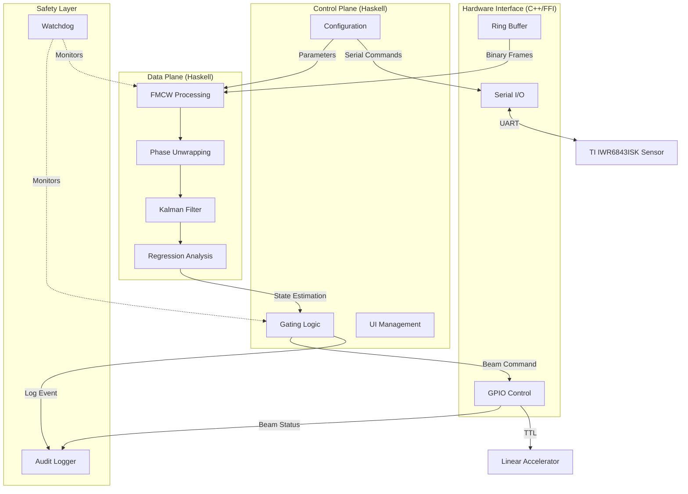
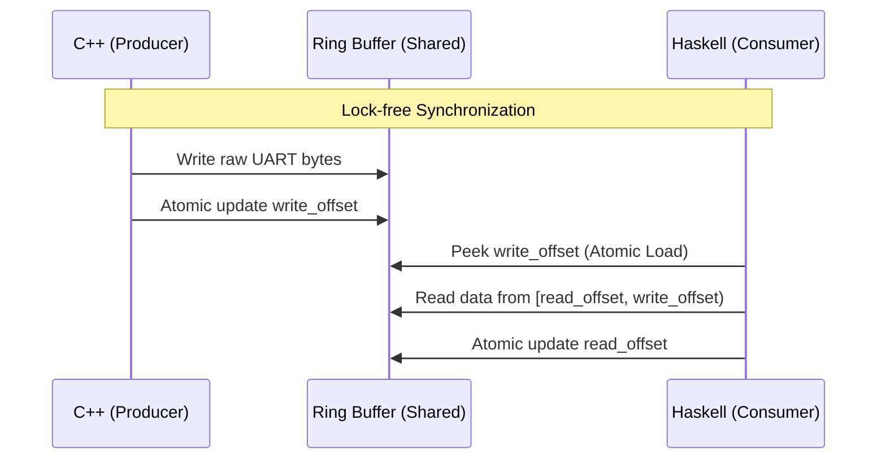
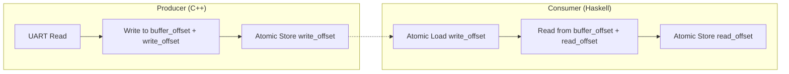
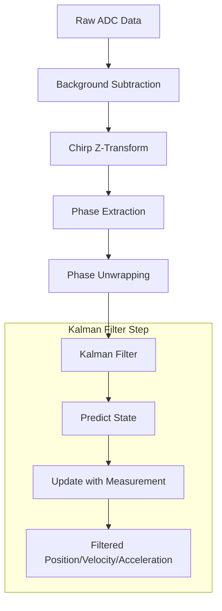
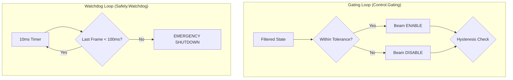
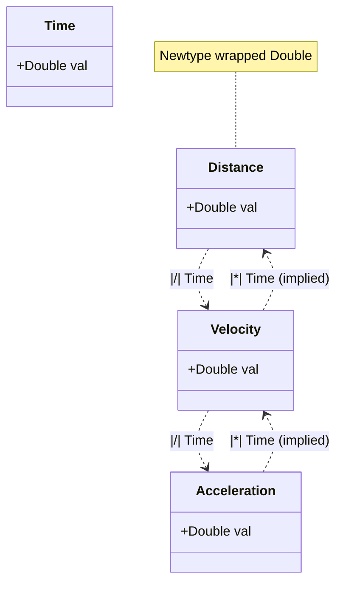
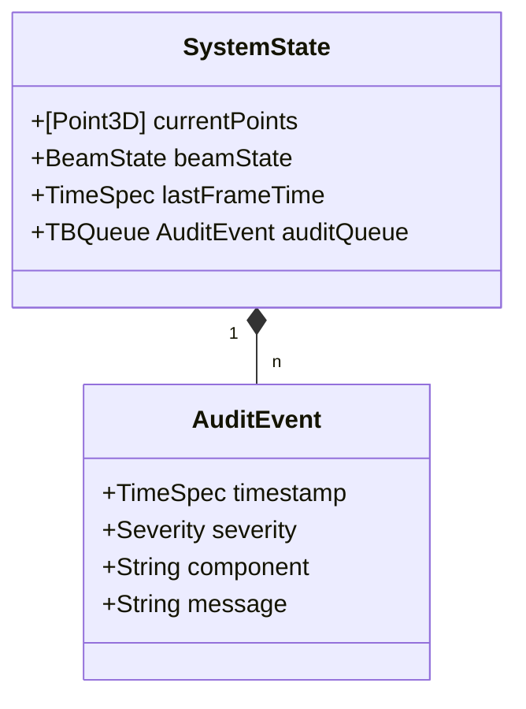
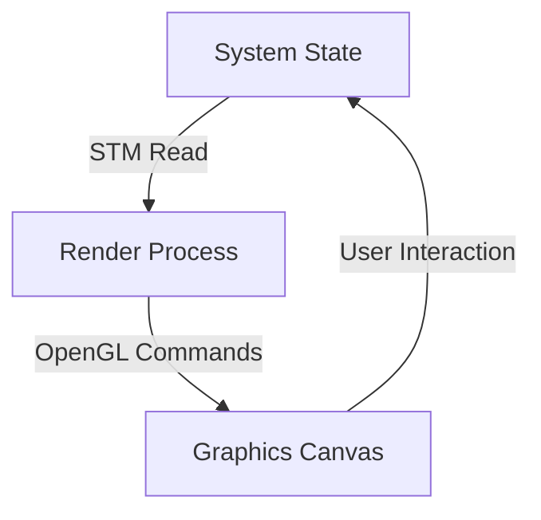

# Lambda-Wave: System Diagrams & High-Level Documentation

This document provides a comprehensive visual and technical overview of the Lambda-Wave architecture, FFI interfaces, and subsystem details.

## 1. High-Level System Architecture

The Lambda-Wave system is organized into three primary planes and a cross-cutting safety layer, ensuring a clear separation between high-level logic, performance-critical processing, and low-level hardware interaction.

---

## 2. Foreign Function Interface (FFI) Documentation

Lambda-Wave uses FFI to bridge Haskell's safety and high-level abstractions with C++'s performance and direct hardware access.

### 2.1 Ring Buffer (C++ & Haskell Bridge)

The Ring Buffer is the most critical FFI component, facilitating zero-copy, lock-free data transfer from the UART ingestion thread (C++) to the TLV parser (Haskell).

**FFI Mechanics:**
- **Shared Memory:** A fixed-size circular buffer is allocated in pinned memory on the C++ side.
- **Atomic Offsets:** `write_offset` and `read_offset` are `std::atomic<size_t>` fields in the `RingBufferControl` struct.
- **ABI Stability:** The Haskell `FFI.RingBuffer.Types` module defines a matching layout to ensure correct field access.

### 2.2 Hardware Control (GPIO & Serial)

Haskell invokes C functions for synchronous, low-latency operations that require direct system calls or specific hardware drivers.

| Interface | Haskell Module | C Function (cbits) | Purpose |
|-----------|----------------|--------------------|---------|
| **GPIO** | `Hardware.Control` | `gpio_write` | Control the physical beam gating signal (TTL). |
| **GPIO** | `Hardware.Control` | `gpio_setup_watchdog` | Initialize the hardware watchdog timer on Pin 27. |
| **Serial** | `Hardware.Control` | `configure_serial_port` | Set baud rate and terminal attributes (POSIX). |
| **UART** | `Hardware.FFI.Common` | `read_from_uart` | Perform non-blocking reads into the Ring Buffer. |

---

## 3. Low-Level Subsystem Diagrams

### 3.1 Hardware Interface: Lock-Free Ring Buffer Logic

This diagram details the producer-consumer synchronization used for high-throughput radar data ingestion.

### 3.2 Signal Processing: Data Pipeline

The signal processing pipeline transforms raw frequency-domain data into precise spatial coordinates and filtered motion vectors.

### 3.3 Control: Gating and Safety Loops

Safety-critical logic that ensures the radiation beam is only active when the patient is within the prescribed tolerance.

### 3.4 Numeric: Kinematics and Units

Strictly-typed kinematic relations ensure physical correctness at compile time.

### 3.5 Data: State and Audit

The central system state and the immutable audit trail for compliance.

### 3.6 UI: Presentation Layer

The visualization layer uses OpenGL to provide real-time feedback to the clinical operator.

